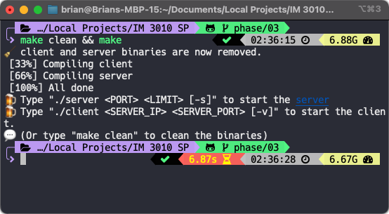

<h1 align="center">A Secure Person2Person (P2P) Micropayment System w/ OpenSSL</h1>

<h3 align="center">IM 3010 Programming Assignment: Phase 03 Implementation - Simplified Version 💩</h3>


+ [Introduction](#introduction)
+ [Environment](#environment)
    + [macOS](#macos)
    + [Ubuntu](#ubuntu)
    + [Certificates and Private Keys](#certificates-and-private-keys)
+ [Usage](#usage)
+ [How to Compile](#how-to-compile)
    + [Compiling Client and Server](#compiling-client-and-server)
        + [Debugging Mode](#debugging-mode)
+ [Mechanism for Secure Transmission](#mechanism-for-secure-transmission)
+ [References](#references)
    + [OpenSSL](#openssl)
    + [Server-side Implementation](#server-side-implementation)
    + [Client-side Implementation](#client-side-implementation)
    + [User Manual](#user-manual)

## Introduction

In **Phase 03**, we are asked to implement a secure transmission for both server-side and client-side programs in the Micropayment System. 

There are five functions in the system, i.e. *registering*, *login*, *listing*, *transacting*, and *exiting*. Asymmetric encryption is asked to be used in *transaction* (*transacting*), implemented by OpenSSL with public key and private key encryption and decryption. 

The implementation in this repository has adopted asymmetric encryption for every transmission between client and server. Peer-to-peer communication is also implemented using asymmetric encryption. Client program will generate a pair of certificate and private key during runtime.

Simply start the server by running `./server <SERVER_PORT> <CONCURRENT_USER_LIMIT> [--silent]`. `-s` or `--silent` is passed in to suppress the output of the encrypted message in server. 

Simply start the client program by running `./client <SERVER_IP> <SERVER_PORT> [--verbose]`. `-v` or `--verbose` is passed in to print the encrypted message in client. 

The user manual will cover the running environment used when developing the program, the environment that this code could be used in, the usage of server and client program, the compilation, the mechanism for secure transmission, and the references when doing this assignment.


<!-- DONE -->

## Environment

### macOS

The environment used to develop this project is:

> Operating System: macOS 12.0.1  
> CPP Standard: C++17

It means that **you can run this program in a macOS environment** if the program is also compiled in the exact environment.

`C++17` is used to serve the standard library header `filesystem` used when creating/deleting a database file.

I am using `sqlite3` to handle user profiles on *the backend*. By default, `sqlite3` is pre-installed in all versions of macOS[^sql].

You may need to install OpenSSL additionally:

```sh
brew install openssl
```

By default, `openssl` is installed in the `/usr/local/opt/openssl` directory. If you use `brew install openssl`, you can use `openssl@3` instead of `openssl@1.1` (with deprecation warnings).

When you run your code, you'll have to include the path manually as in `OPENSSLCPPFLAGS` and `LDFLAGS`:

```sh
INCLUDE = -I$(WORKDIR)/include/\
                    -I$(WORKDIR)/src/					

OPENSSLCPPFLAGS = -I/usr/local/opt/openssl@1.1/include
LDFLAGS = -L/usr/local/opt/openssl@1.1/lib
CFLAGS=-lstdc++ -lpthread -lsqlite3 $(LDFLAGS) $(INCLUDE) $(OPENSSLCPPFLAGS) -lssl -lcrypto 

gcc -std=c++17 yourprogram.cpp $(CFLAGS) -o yourprogram
```

Same implementation can be seen in `Makefile`.

[^sql]: [How to install SQLite on macOS](https://flaviocopes.com/sqlite-how-to-install/)

### Ubuntu

For the given `client` and `server` binary, you can run it on:

> Operating System: Ubuntu 20.04  
> CPP Standard: C++17


To compile, **you may need to install some extra dependencies/packages** on your system:

1. Install `sqlite3` (you can see why in the [References](#references) section)

    ```sh
    sudo apt install sqlite3
    sudo apt-get install libsqlite3-dev
    ```
2. Install `openssl`

    ```sh
    sudo apt-get install openssl
    sudo apt-get install libssl-dev
    ```

    Installing `openssl` alone is not enough. You also need to install `libssl-dev` to compile both files (as in my case).
3. Make sure your GCC version is up-to-date (GCC 9-ish) to support `C++17` (**please ignore this if you did not mess up with your environment**)

    ```sh
    sudo add-apt-repository ppa:ubuntu-toolchain-r/test
    sudo apt update
    sudo apt install gcc-9 g++-9
    sudo update-alternatives --install /usr/bin/gcc gcc /usr/bin/gcc-9 60 --slave /usr/bin/g++ g++ /usr/bin/g++-9 # to make sure gcc is using the latest version of GCC
    ```

I am testing out the Linux-formatted `client` and `server` binary on [Karton](https://karton.github.io) from my MacBook. Karton is developed based on Docker containers. The code is also tested on Ubuntu 20.04 virtual box. **You may encounter strange behavior occasionally on Linux**, since the code is mostly tested on macOS.

**Notice that the user interface requires [Nerd Fonts](https://github.com/ryanoasis/nerd-fonts) to render**.


### Certificates and Private Keys

By default, you shall see a `certs/` directory listed in the root directory of the project (downloaded through [the release page](https://github.com/icheft/Secure-Person2Person-P2P-Micropayment-System/releases)). This directory contains the certificates and private keys used for the program so that you do not need to regenerate them on the first run.

Since client's certificate and private keys will be generated in runtime, you'll only have to generate server's certificate and private key. The server's certificate and private key will be generated in the `certs/` directory.

Use the following command if `server.crt`, `server.key`, and `server.pem` are missing in the `certs/` directory (i.e. if you clone this repository):

```sh
sh create_ca.sh cert server server # this will generate server.crt, server.key, and server.pem using the configuration file 
```

+ `server.crt`: the certificate of the server
+ `server.key`: the private key of the server
+ `server.pem`: the public key of the server

Client's certificate (and public key) and private keys will be generated in the `certs/` directory in runtime, so when you download the released pack, you should see nothing. 

## Usage

**TL;DR** (assuming you don't delete the `certs/` directory):  

```sh
./server <SERVER_PORT> [CONCURRENT_USER_LIMIT] [--silent]
```

```sh
./client <SERVER_IP> <SERVER_PORT> [--verbose]
```


## How to Compile

**Notice that you will need to have the [dependencies installed](#ubuntu) first if you are using Linux**. Please click [here](#ubuntu) if you miss the part.


### Compiling Client and Server

You can simply start off by doing:

```sh
make clean && make
```

You shall see the following output on your terminal:



#### Debugging Mode

If strange behaviors occur during runtime, you can use `make debug` to examine the program(s). Usually errors (encryption fails or decryption fails) will occur at client-side. Please remember the cert ID for the failed client, and set the `UID_TEST` macro to that ID.

Run the client program by changing the `./client` to `./client_d` and `./server` to `./server_d`. 


## Mechanism for Secure Transmission

+ public key will be sent to client when a client connect to a server
+ client will use the public key to encrypt the message and send it back to the server
+ server will use `private_decrypt` to decrypt the message with its private key
+ server will encrypt the message with its private key
+ server will send the message to the client, the client will have to use its public key to decrypt the message
+ transaction between peer A and peer B:
    + if A wants to send a message to B
    + A will encrypt the message with B's public key 
    + A will send the message to B
    + B will decrypt the message with its private key
    + B will send the message to server, using server's public key to encrypt the message

<!-- DONE -->

## References

### OpenSSL

+ SSL Socket:
    + [OpenSSL Official Documentation](https://www.openssl.org/docs/manmaster/man3/) <https://www.openssl.org/docs/manmaster/man3/>
    + [SSL socket 小攻略](https://hackmd.io/@J-How/B1vC_LmAD)
    + [SSL通道小攻略](https://hackmd.io/@G9IwPB5oTmOK_qFXzKABGg/rJkvqdgJ_)
    + https://www.ibm.com/docs/en/ztpf/2020?topic=apis-ssl-ctx-load-verify-locations
    + <https://stackoverflow.com/questions/28366384/troubles-with-ssl-ctx-load-verify-locations> → a client cannot use same configuration file for its key and cert pair
+ Installation
    + 编译Linux内核时出现 fatal error: openssl/opensslv.h 解决的办法 https://zhuanlan.zhihu.com/p/61636004 
+ Key Generation
    + https://stackoverflow.com/questions/10175812/how-to-generate-a-self-signed-ssl-certificate-using-openssl
    + https://docs.oracle.com/cd/E65459_01/admin.1112/e65449/content/admin_csr.html
    + https://www.ibm.com/docs/en/ztpf/1.1.0.15?topic=gssccr-configuration-file-generating-self-signed-certificates-certificate-requests

### Server-side Implementation

+ Creation of a **database** for handling multiple input and querying

    Background: As far as I know, handling simultaneous reads and writes can be a hassle when implemented manually. I consulted to my friends studying CSIE, and they also believe using a database could be a more practical and reasonable way to implement such querying function.

    I looked it up and find out that `sqlite` integrates so well with C/C++. `sqlite` can drive a db of up to 140TB, allows multiple simultaneous reads and, like other databases stores data in files on disk.

    Though for our use case, the need for a database is unnecessary due to the fact that we are only opening to **few users** (3) at a time, I still feel this urge to learn how to implement one for this project. 
+ Deletion of the database (`*.db`)
    + [Filesystem Library in `C++17`](https://stackoverflow.com/a/59424074/10871988) at <https://stackoverflow.com/a/59424074/10871988>
+ More on sqlite C++
    + <https://github.com/fnc12/sqlite_orm> → I am using this
    + <https://www.runoob.com/sqlite/sqlite-c-cpp.html>
+ Thread and Worker Pool
    + <https://ncona.com/2019/05/using-thread-pools-in-cpp/> - a very good article explaining how to use thread pools
    + <https://stackoverflow.com/questions/15752659/thread-pooling-in-c11>
    + <https://stackoverflow.com/questions/48943929/killing-thread-from-another-thread-c>
    + [x] <https://github.com/vit-vit/ctpl> → I am using this
+ Handling `SIGINT`
    + <https://stackoverflow.com/questions/1641182/how-can-i-catch-a-ctrl-c-event>
+ `TIME WAIT`
    
    Background: `server` could not close connection after the socket is closed:

    ```sh
    sudo netstat -tanl | grep 8888
    ```
    ```
    tcp4       0       0       127.0.0.1.64480       127.0.0.1.8888       TIME_WAIT
    ```
    <https://stackoverflow.com/questions/23915304/how-to-avoid-time-wait-for-server-sockets>
+ Catch SIGPIPE from sudden death of a client
    + <https://stackoverflow.com/questions/61688091/catching-client-exit-from-server-on-socket-programing>
    + <https://stackoverflow.com/questions/26752649/so-nosigpipe-was-not-declared>
    + <https://stackoverflow.com/questions/18935446/program-received-signal-sigpipe-broken-pipe/18963142>


### Client-side Implementation


+ Repositories
    + [Learn Network Protocol and Programming Using C](https://github.com/apsrcreatix/Socket-Programming-With-C) at <https://github.com/apsrcreatix/Socket-Programming-With-C>
    + [Peer to peer program in C](https://github.com/um4ng-tiw/Peer-to-Peer-Socket-C) at <https://github.com/um4ng-tiw/Peer-to-Peer-Socket-C>
    + [C Multithreaded Client-Server](https://github.com/RedAndBlueEraser/c-multithreaded-client-server) at <https://github.com/RedAndBlueEraser/c-multithreaded-client-server>
    + [Socket programming examples in C++](https://github.com/zappala/socket-programming-examples-c) at <https://github.com/zappala/socket-programming-examples-c>
+ Others
    + [Parse (split) a string in C++ using string delimiter (standard C++)](https://stackoverflow.com/a/14266139/10871988) at <https://stackoverflow.com/a/14266139/10871988>
    + [Finding Unused Port in C++](https://stackoverflow.com/a/1107242/10871988) at <https://stackoverflow.com/a/1107242/10871988>
    + [Unix Specification (link to `bind()`)](https://pubs.opengroup.org/onlinepubs/007908799/xns/bind.html) at <https://pubs.opengroup.org/onlinepubs/007908799/xns/bind.html>, but of course many more functions are looked up
    + [Port Forwarding for a Docker Container](https://docs.docker.com/config/containers/container-networking/) at <https://docs.docker.com/config/containers/container-networking/>
    + [Karton for not running on virtual machine](https://karton.github.io) at <https://karton.github.io>


### User Manual


+ [Eisvogel](https://github.com/Wandmalfarbe/pandoc-latex-template) at <https://github.com/Wandmalfarbe/pandoc-latex-template>


