<h1 align="center">A Secure Person2Person (P2P) Micropayment System - Server</h1>

<h3 align="center">IM 3010 Programming Assignment: Phase 02 Implementation</h3>

+ [Introduction](#introduction)
+ [Environment](#environment)
    + [macOS](#macos)
    + [Ubuntu](#ubuntu)
+ [Usage](#usage)
    + [Running Server Program](#running-server-program)
    + [Working Server](#working-server)
        + [When Clients Connect to Server](#when-clients-connect-to-server)
        + [User Registration](#user-registration)
        + [User Login](#user-login)
        + [Information Listing](#information-listing)
        + [P2P Transaction](#p2p-transaction)
        + [User Logout](#user-logout)
    + [Terminating Server Program](#terminating-server-program)
    + [Running Client Program](#running-client-program)
    + [Exiting Client Program](#exiting-client-program)
+ [How to Compile](#how-to-compile)
    + [Compiling Server Only](#compiling-server-only)
    + [Compiling Client and Server](#compiling-client-and-server)
+ [References](#references)
    + [Server-side Implementation](#server-side-implementation)
    + [Client-side Implementation](#client-side-implementation)
    + [User Manual](#user-manual)
+ [Development](#development)
    + [Progress](#progress)
    + [`Database` Usage](#database-usage)
    + [Trouble-shooting](#trouble-shooting)
        + [Environment Setup on Linux](#environment-setup-on-linux)
        + [Server](#server)
        + [IP and Port # Setup](#ip-and-port--setup)
        + [`sqlite3`](#sqlite3)
    + [ToDos and References](#todos-and-references)
    
<!-- DONE -->

## Introduction

In **Phase 02**, we are asked to implement a server-side program to handle requests sent by clients in the Micropayment System. Functions for a server-side program include *registering*, *login*, *listing*, *transacting*, and *exiting*. Simply start running the program by `./server <SERVER_PORT> <CONCURRENT_USER_LIMIT>` after compilation (which can be done by `make server`).

`CONCURRENT_USER_LIMIT` is completely optional. The maximum is set to the number of concurrent threads supported by the implementation.

The user manual will cover the running environment used when developing the program, the environment that this code could be used in, the usage of the server-side program, the compilation, and the references when doing this assignment.


<!-- TODO: check if the linux part is true @ Michael-->

## Environment

### macOS

The environment used to develop this project is:

> Operating System: macOS 12.0.1  
> CPP Standard: C++17

It means that **you can run this program in a macOS environment** if the program is also compiled in the exact environment.

`C++17` is used to serve the standard library header `filesystem` used when creating/deleting a database file.

I am using `sqlite3` to handle user profiles on *the backend*. By default, `sqlite3` is pre-installed in all versions of macOS[^sql].

[^sql]: [How to install SQLite on macOS](https://flaviocopes.com/sqlite-how-to-install/)

### Ubuntu

For the given `server` binary, you can run it on:

> Operating System: Ubuntu 20.04  
> CPP Standard: C++17


To compile, **you may need to install some extra dependencies/packages** on your system:

1. Install `sqlite3` (you can see why in the [References](#references) section)

    ```sh
    sudo apt install sqlite3
    sudo apt-get install libsqlite3-dev
    ```
2. Make sure your GCC version is up-to-date (GCC 9-ish) to support `C++17` (**please ignore this if you did not mess up with your environment**)

    ```sh
    sudo add-apt-repository ppa:ubuntu-toolchain-r/test
    sudo apt update
    sudo apt install gcc-9 g++-9
    sudo update-alternatives --install /usr/bin/gcc gcc /usr/bin/gcc-9 60 --slave /usr/bin/g++ g++ /usr/bin/g++-9 # to make sure gcc is using the latest version of GCC
    ```


I am testing out the Linux-formatted `server` binary on [Karton](https://karton.github.io) from my MacBook. Karton is developed based on Docker containers. The code is also tested on Ubuntu 20.04 virtual box. 

**Notice that the user interface requires [Nerd Fonts](https://github.com/ryanoasis/nerd-fonts) to render**.


<!-- DONE: add screenshots -->

## Usage

**TL;DR**:  

```sh
./server <SERVER_PORT> <[OPTIONAL] CONCURRENT_USER_LIMIT>
```

```sh
./client <SERVER_IP> <SERVER_PORT>
```

### Running Server Program


Before running the `client` program, you have to make sure that the `server` is running. You can start the server on port 8888 and limited to a maximum of three concurrent connected clients by running:

```sh
./server 8888 3
```

Here is a look of the above command:

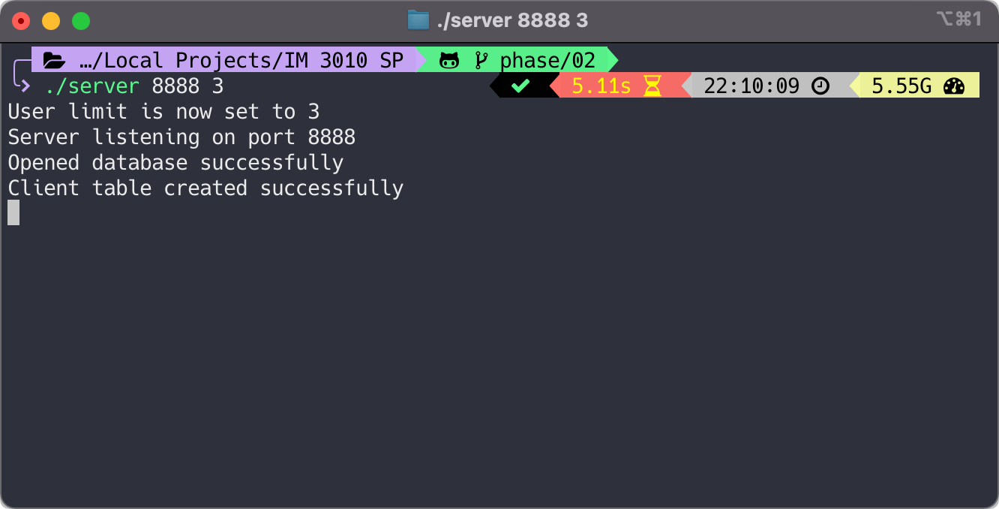

The basic usage is: `./server <SERVER_PORT> <CONCURRENT_USER_LIMIT>`.


And that is simply it. You can have a glimpse of what is going on in the server by peeking into the `server.db` file via `sqlite3` simply by typing in:

```sh
sqlite3 server.db
```

and you shall get access to the database with a table named `client` that stores all user data, including users' connection states.

So together with `sqlite3`, you will be able to gain access to the database and keep the server running at the same time:

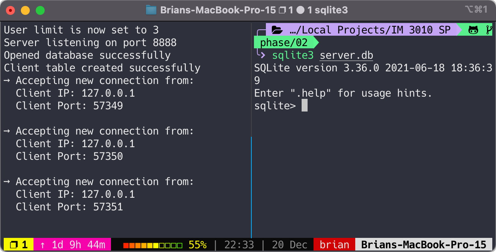


### Working Server

The server will always throw out `[<CLIENT_MSG>] from <CLIENT_PORT>@<CLIENT_PUBLIC_PORT>` when a message is received from a client.

#### When Clients Connect to Server

When a client connects to the server, it will show IP address and port of that client. 

The following screenshots show how three clients connect to the server listening on port 8888:

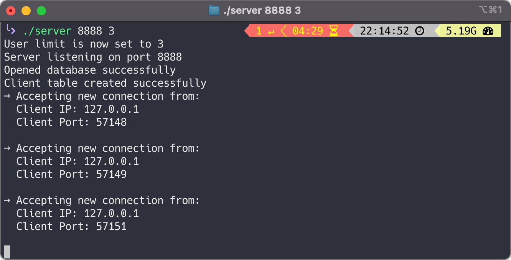

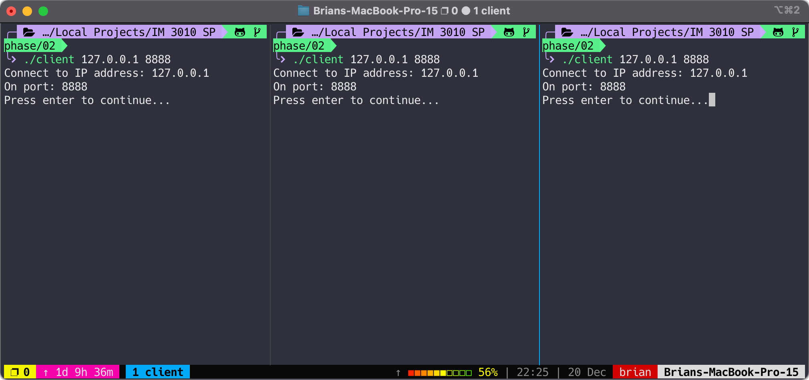

#### User Registration

When a user registers, you shall also see an update directly within the database.

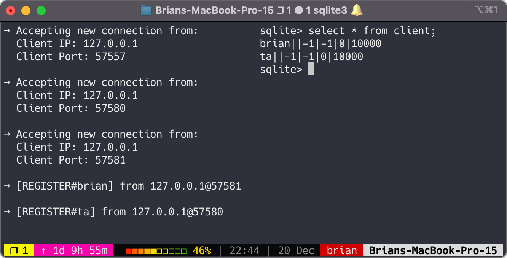

If a user already registered, the server will return `210 FAIL` to the client.

#### User Login

You see that the server recorded IP address, public port, private port (the port specified by the logged in client as shown in `[brian#57609]`).

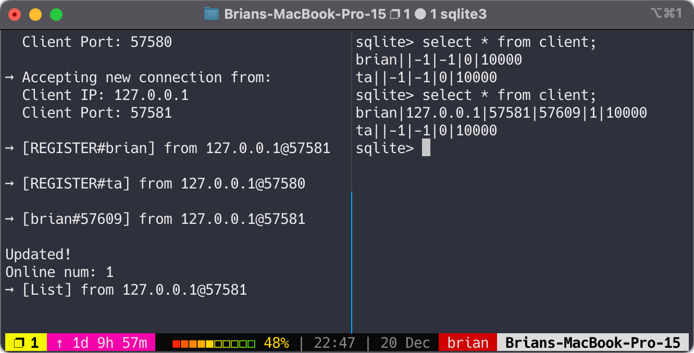

I will log in with three users on three clients in the rest of the demonstration.

#### Information Listing

A user must log in before requesting for system information. A message `Please login first` will be sent to the client if the session is not logged in. 

Otherwise, it will show the system information to the user as specified in the assignment specification.

#### P2P Transaction

As can be seen below, the `[brian#2000#ta]` message indicates that user `brian` transfers 2000 dollars to `ta`. 

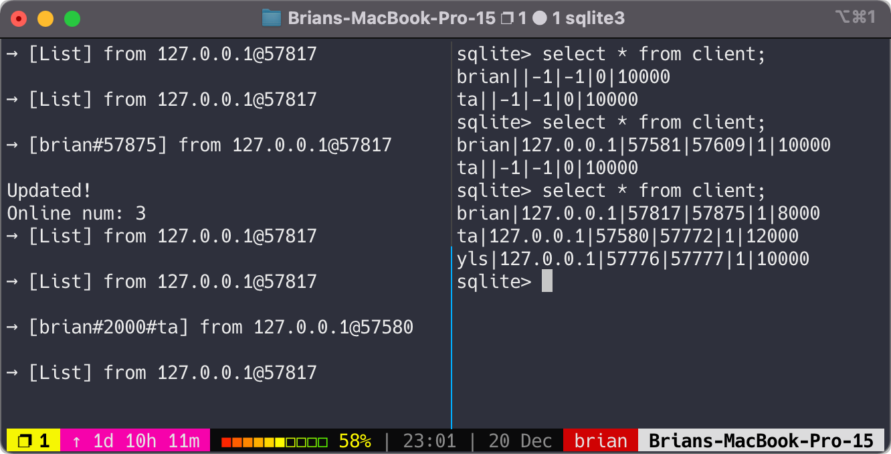


You can also see that the database is updated accordingly.

#### User Logout

There might be three cases:

**When a user logs out**:  

The server will prompt *who* logs out.

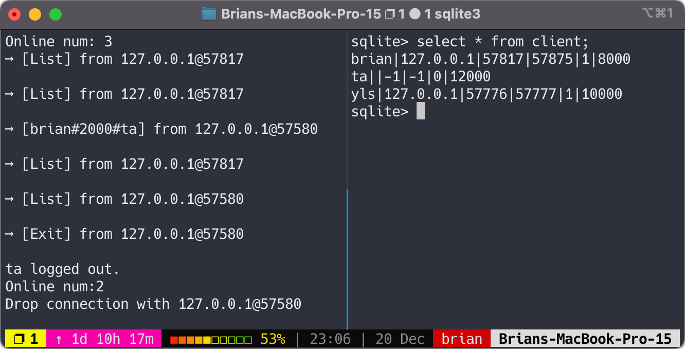

**When a client exits properly**:  

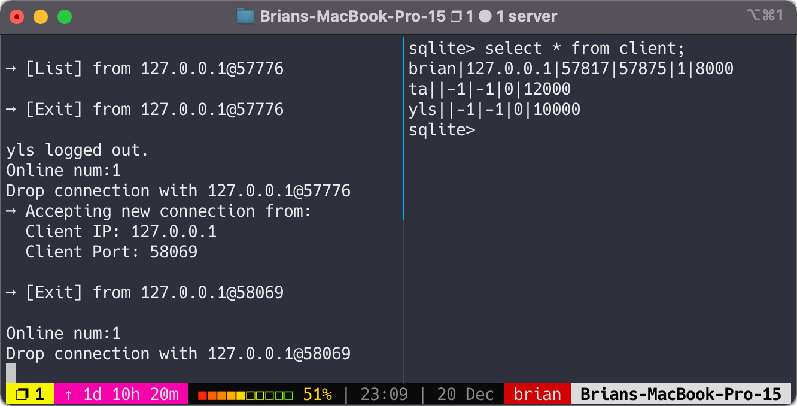


**When a client terminates suddenly (and returns a `SIGPIPE`)**:  

This is not really possible since the client is well implemented. But if it does, server will handle:

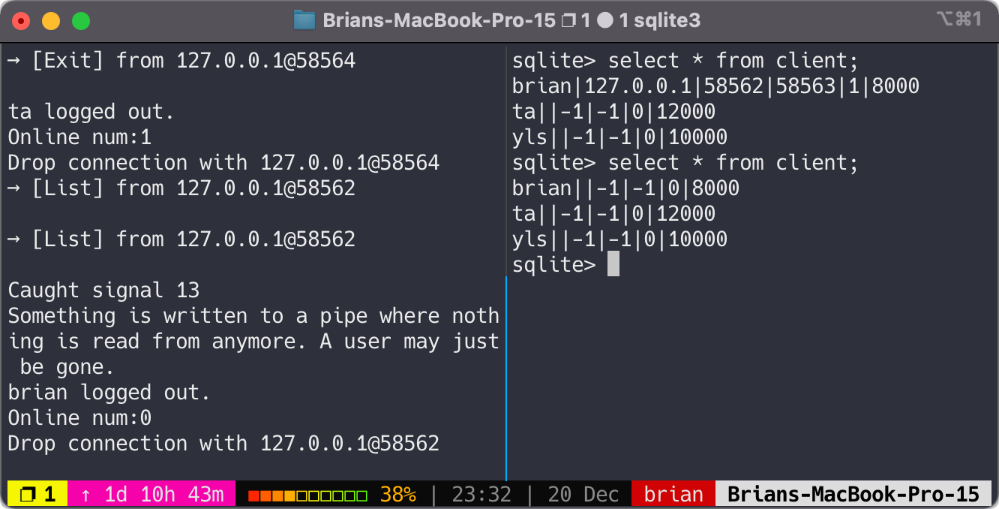

### Terminating Server Program

To terminate the server, you will have to `CTRL + C` while the server is running. Signal handling is implemented so that you can do it safely.

The termination of the server will also cause the deletion of the db file `server.db`. The settings for not deleting the database can only be modified from the source code at `src/Database.cpp`.

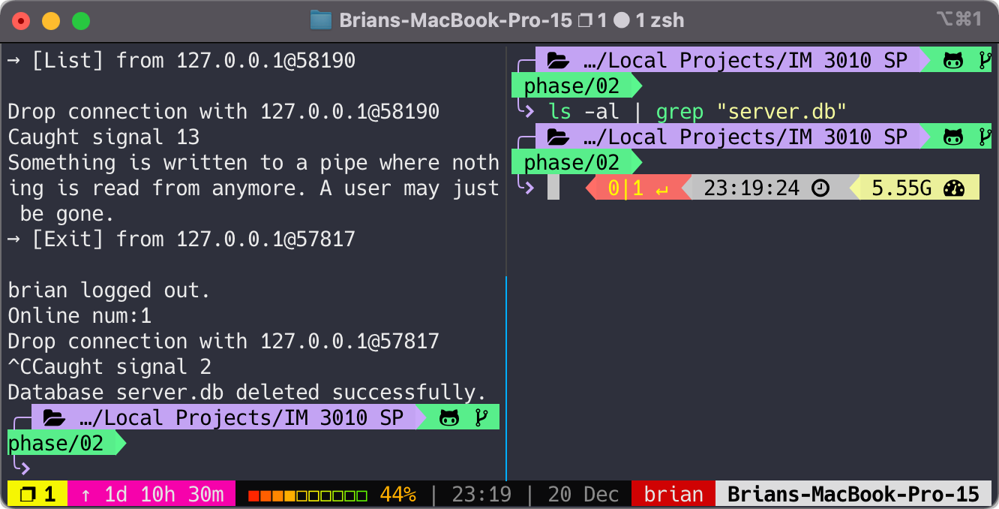


### Running Client Program

For the client part, I won't show the screenshot in this documentation again; you can see the demos/screenshots in *Phase 01 User Manual*.

If you are testing out the client program on your localhost:

```sh
./client 127.0.0.1 8888
```

Otherwise, you will have to figure out the right server IP address and the port the server is listening on.

The basic usage is: `./client <SERVER_IP> <SERVER_PORT>`.


### Exiting Client Program

You can exit a client using two methods: 

1. Typing in `5` to *properly tell the server you are to exit* and quit the session peacefully, or
2. Hitting `CTRL + C` to forcefully terminate the session; `server` will handle the error accordingly.


<!-- DONE -->


## How to Compile

**Notice that you will need to have the [dependencies installed](#ubuntu) first if you are using Linux**. Please click [here](#ubuntu) if you miss the part.

### Compiling Server Only

You can start the program already by typing `./server <SERVER_PORT> <CONCURRENT_USER_LIMIT>` into your terminal if you are on a Linux distribution (*Ubuntu* is used for testing) or on a macOS.

To rebuild the program, on either **macOS** or a **Linux** system, make sure to install the dependencies first before you run `make server` in the terminal app.

It will take a bit longer to compile `server` as compared to `client` since it is linking much more powerful and bigger libraries (`-lsqlite3` for using database). 

If `server` binary already exists, you may want to run `make clean` first to remove the file.

If done properly, you should see the following output:

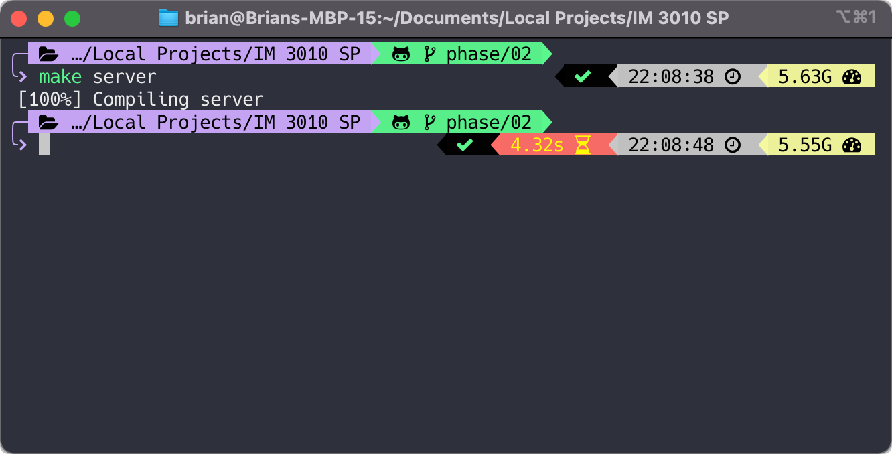

### Compiling Client and Server

You can simply start off by doing:

```sh
make clean && make
```

If no errors occur, you shall see the following output on your terminal:

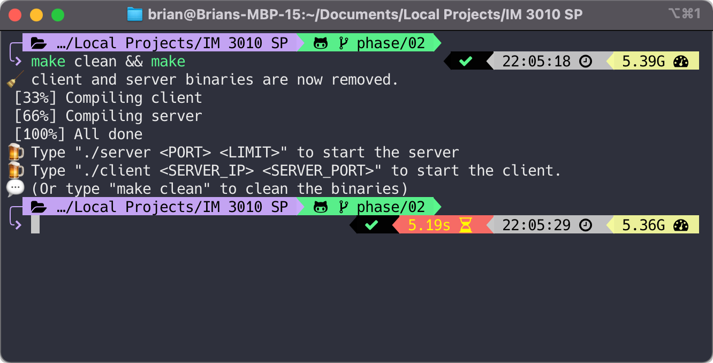


<!-- DONE -->

## References


### Server-side Implementation

+ [x] Creation of a **database** for handling multiple input and querying

    Background: As far as I know, handling simultaneous reads and writes can be a hassle when implemented manually. I consulted to my friends studying CSIE, and they also believe using a database could be a more practical and reasonable way to implement such querying function.

    I looked it up and find out that `sqlite` integrates so well with C/C++. `sqlite` can drive a db of up to 140TB, allows multiple simultaneous reads and, like other databases stores data in files on disk.

    Though for our use case, the need for a database is unnecessary due to the fact that we are only opening to **few users** (3) at a time, I still feel this urge to learn how to implement one for this project. 
+ [x] Deletion of the database (`*.db`)
    + [Filesystem Library in `C++17`](https://stackoverflow.com/a/59424074/10871988) at <https://stackoverflow.com/a/59424074/10871988>
+ [x] More on sqlite C++
    + <https://github.com/fnc12/sqlite_orm> → I am using this
    + <https://www.runoob.com/sqlite/sqlite-c-cpp.html>
+ [x] Thread and Worker Pool
    + <https://ncona.com/2019/05/using-thread-pools-in-cpp/> - a very good article explaining how to use thread pools
    + <https://stackoverflow.com/questions/15752659/thread-pooling-in-c11>
    + <https://stackoverflow.com/questions/48943929/killing-thread-from-another-thread-c>
    + [x] <https://github.com/vit-vit/ctpl> → I am using this
+ [x] Handling `SIGINT`
    + <https://stackoverflow.com/questions/1641182/how-can-i-catch-a-ctrl-c-event>
+ [x] `TIME WAIT`
    
    Background: `server` could not close connection after the socket is closed:

    ```sh
    sudo netstat -tanl | grep 8888
    ```
    ```
    tcp4       0       0       127.0.0.1.64480       127.0.0.1.8888       TIME_WAIT
    ```
    <https://stackoverflow.com/questions/23915304/how-to-avoid-time-wait-for-server-sockets>
+ [x] Catch SIGPIPE from sudden death of a client
    + <https://stackoverflow.com/questions/61688091/catching-client-exit-from-server-on-socket-programing>
    + <https://stackoverflow.com/questions/26752649/so-nosigpipe-was-not-declared>
    + <https://stackoverflow.com/questions/18935446/program-received-signal-sigpipe-broken-pipe/18963142>


### Client-side Implementation

(from phase01)

+ Repositories
    + [Learn Network Protocol and Programming Using C](https://github.com/apsrcreatix/Socket-Programming-With-C) at <https://github.com/apsrcreatix/Socket-Programming-With-C>
    + [Peer to peer program in C](https://github.com/um4ng-tiw/Peer-to-Peer-Socket-C) at <https://github.com/um4ng-tiw/Peer-to-Peer-Socket-C>
    + [C Multithreaded Client-Server](https://github.com/RedAndBlueEraser/c-multithreaded-client-server) at <https://github.com/RedAndBlueEraser/c-multithreaded-client-server>
    + [Socket programming examples in C++](https://github.com/zappala/socket-programming-examples-c) at <https://github.com/zappala/socket-programming-examples-c>
+ Others
    + [Parse (split) a string in C++ using string delimiter (standard C++)](https://stackoverflow.com/a/14266139/10871988) at <https://stackoverflow.com/a/14266139/10871988>
    + [Finding Unused Port in C++](https://stackoverflow.com/a/1107242/10871988) at <https://stackoverflow.com/a/1107242/10871988>
    + [Unix Specification (link to `bind()`)](https://pubs.opengroup.org/onlinepubs/007908799/xns/bind.html) at <https://pubs.opengroup.org/onlinepubs/007908799/xns/bind.html>, but of course many more functions are looked up
    + [Port Forwarding for a Docker Container](https://docs.docker.com/config/containers/container-networking/) at <https://docs.docker.com/config/containers/container-networking/>
    + [Karton for not running on virtual machine](https://karton.github.io) at <https://karton.github.io>


### User Manual

(from phase01)

+ [Eisvogel](https://github.com/Wandmalfarbe/pandoc-latex-template) at <https://github.com/Wandmalfarbe/pandoc-latex-template>

## Development

### Progress

本階段為 Server 端程式的開發，同學所撰寫的 Server 端程式必須要能:


**Submission**:

```sh
sh sub.sh <SID>
```

### `Database` Usage

```cpp
Database* db = new Database(true, true);
cout << db->user_register("brian", "127.0.0.1") << endl;
cout << db->user_login("brian", "127.0.0.1", 65312, 8888) << endl;
cout << db->user_logout("127.0.0.1", 65313) << endl;
cout << db->user_transaction("brian", "michael", 2000) << endl;

auto online_users = db->list(); // online is true by default

cout << "Online num: " << online_users.size() << endl;
for (auto& user : online_users) {
    cout << user.username << "#" << user.ip << "#" << user.private_port << endl;
}
cout << "\n";
```

```cpp
#define REGISTER_OK 100
#define REGISTER_FAIL 210

#define LOGIN_SUCCESS 110
#define LOGIN_AUTH_FAIL 220
#define LOGIN_EXIST 230
#define USER_NOT_LOGIN 240

#define LOGOUT_SUCCESS 120
#define LOGOUT_FAIL 250

#define TRANSFER_OK 130
#define TRANSFER_FAIL 260
#define TRANSFER_SENDER_BANKRUPT 270

#define QUERY_OK 300
#define QUERY_ERROR 400

```


### Trouble-shooting

#### Environment Setup on Linux

+ Make sure you have your GCC version `>= 8`
    ```sh
    sudo add-apt-repository ppa:ubuntu-toolchain-r/test
    sudo apt update
    sudo apt install gcc-9 g++-9
    sudo update-alternatives --install /usr/bin/gcc gcc /usr/bin/gcc-9 60 --slave /usr/bin/g++ g++ /usr/bin/g++-9 # to make sure gcc is using the latest version of GCC
    ```
+ Also have to install `sqlite3`
    ```sh
    sudo apt install sqlite3
    sudo apt-get install libsqlite3-dev
    ```

#### Server 

Since we are using a thread pool here, all clients must disconnect before leaving the server to ensure a better shutdown process.

#### IP and Port # Setup
**On Parallels**:

1. `10.211.55.4`
2. on port `8888`

**On workstation**:

1. `sudo ufw allow 60100`
2. `./client 140.112.106.45 60100`

**Karton**: 

Execute everything within Karton.

#### `sqlite3`

**Linux**:

```
sudo apt install sqlite3
sudo apt-get install libsqlite3-dev
```

**macOS**:

`sqlite3` is pre-installed on macOS.


### ToDos and References

+ [x] Creation of a database for handling multiple input and querying
    + see [test.c](./test/test.c)
+ [x] Deletion of the database (`*.db`)
    + [Filesystem Library in `C++17`](https://stackoverflow.com/a/59424074/10871988) see [file.cpp](./test/file.cpp)
+ [x] More on sqlite C++
    + <https://github.com/fnc12/sqlite_orm>
    + <https://www.runoob.com/sqlite/sqlite-c-cpp.html>
+ [x] Thread and Worker Pool - mine works between 1 and 2
    + <https://ncona.com/2019/05/using-thread-pools-in-cpp/>
    + <https://stackoverflow.com/questions/15752659/thread-pooling-in-c11>
    + <https://stackoverflow.com/questions/48943929/killing-thread-from-another-thread-c>
    + [x] <https://github.com/vit-vit/ctpl>
+ [x] Handling `SIGINT`
    + <https://stackoverflow.com/questions/1641182/how-can-i-catch-a-ctrl-c-event>
+ [x] VSC not showing errors
    + Fixed as mentioned in [this issue](https://github.com/microsoft/vscode-cpptools/issues/2164#issuecomment-399232736)
+ [x] `TIME WAIT`
    + Background: Server couldn't close connection after the socket is closed:
        ```sh
        sudo netstat -tanl | grep 8888
        ```
        ```
        tcp4       0      0  127.0.0.1.64480                               127.0.0.1.8888                                TIME_WAIT
        ```
        <https://stackoverflow.com/questions/23915304/how-to-avoid-time-wait-for-server-sockets>
+ [ ] cmd args
    + <https://github.com/mirror/tclap>
    + <https://github.com/vietjtnguyen/argagg>
+ [ ] Makefile: Nicer linkage
    + <https://stackoverflow.com/questions/451413/make-makefile-progress-indication>
    + <https://stackoverflow.com/a/16945143/10871988>
    + <https://www.gnu.org/software/make/manual/make.html>
+ [x] Catch SIGPIPE from sudden death of a client
    + <https://stackoverflow.com/questions/61688091/catching-client-exit-from-server-on-socket-programing>
    + <https://stackoverflow.com/questions/26752649/so-nosigpipe-was-not-declared>
    + <https://stackoverflow.com/questions/18935446/program-received-signal-sigpipe-broken-pipe/18963142>